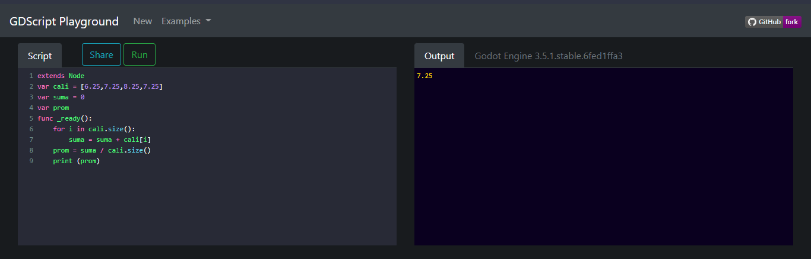
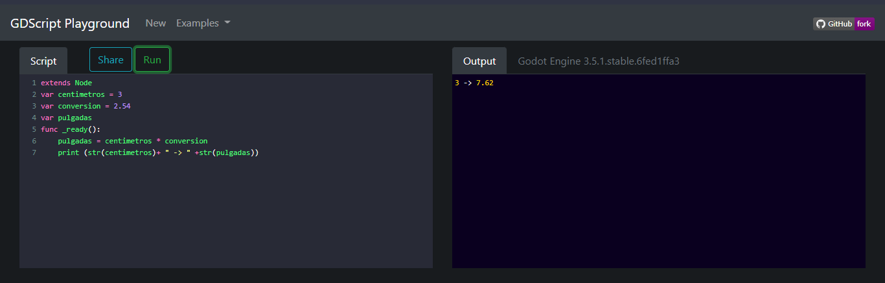
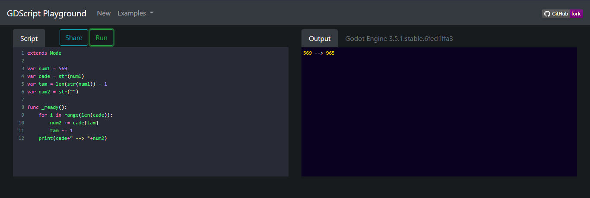
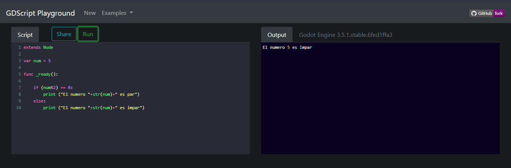
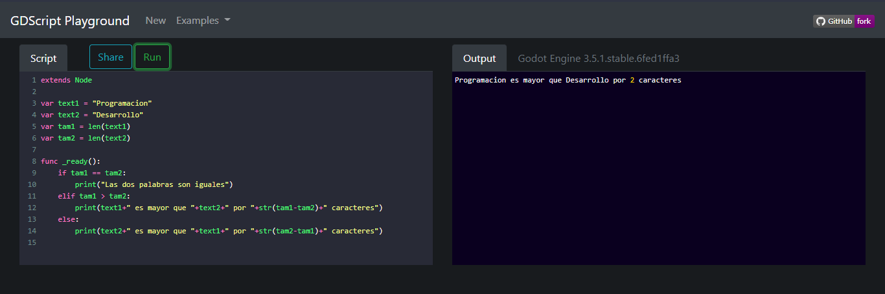
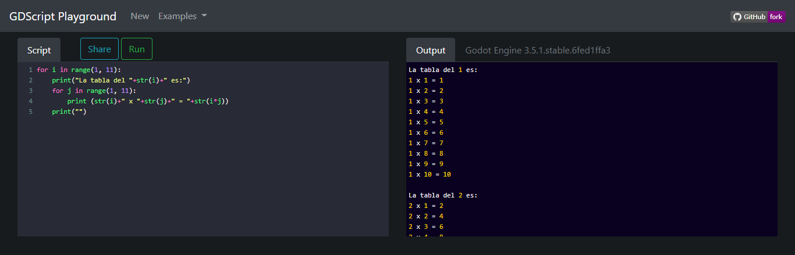
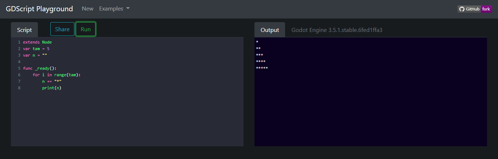
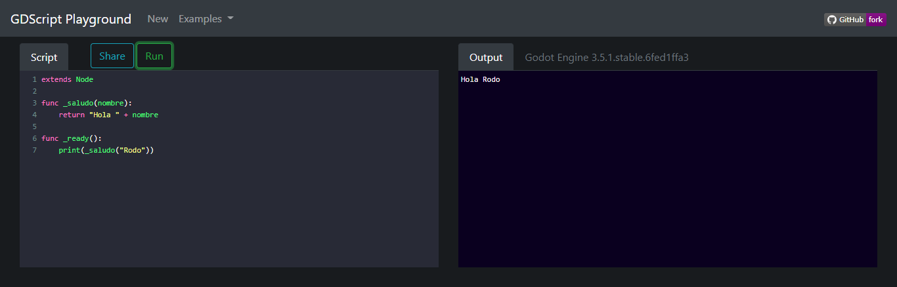

# Ejercicios de lógica con GDScript
## Ejercicio 1

Escriba un programa que calcule el promedio de 4 notas. Por ejemplo 9, 6, 8, 6. La consola debe mostrar:

    7.25

Resultado:

 

## Ejercicio 2

Escriba un programa que convierta de centímetros a pulgadas. Una pulgada es igual a 2.54 centímetros. Por ejemplo 3 pulgadas, la consola debe mostrar:

    3 -> 7.62

Resultado:

 

## Ejercicio 3

Escriba un programa que invierta un numero de tres cifras. Por ejemplo "569", la consola debe mostrar:

    569 -> 965

Resultado:

## Ejercicio 4

Escriba un programa que determine si el número entero es par o no. Por ejemplo 5, la consola debe mostrar:

    5 es impar

Resultado:

## Ejercicio 5

Escriba un programa que compare dos palabras, y que indique cuál de ellas es la más larga y por cuántas letras lo es. Por ejemplo "Programacion" y "Desarrollo", la consola debe mostrar:

    Programacion es mas larga por 2 caracteres

Resultado:

## Ejercicio 6

Escriba un programa que compare dos números, y los muestre ordenados de menor a mayor Por ejemplo "6" y "3", la consola debe mostrar:

    3
    6

Resultado:

## Ejercicio 7

Escriba un programa que muestre por consola todas las tablas de multiplicar como la siguiente:

    La tabla del 1 es:
    1 x 1 = 1
    1 x 2 = 2
    1 x 3 = 3
    1 x 4 = 4
    1 x 5 = 5
    1 x 6 = 6
    1 x 7 = 7
    1 x 8 = 8
    1 x 9 = 9
    1 x 10 = 10

    La tabla del 2 es:
    2 x 1 = 2
    2 x 2 = 4
    2 x 3 = 6
    2 x 4 = 8
    2 x 5 = 10
    2 x 6 = 12
    2 x 7 = 14
    2 x 8 = 16
    2 x 9 = 18
    2 x 10 = 20

    La tabla del 3 es:
    3 x 1 = 3
    3 x 2 = 6
    3 x 3 = 9
    3 x 4 = 12
    3 x 5 = 15
    3 x 6 = 18
    3 x 7 = 21
    3 x 8 = 24
    3 x 9 = 27
    3 x 10 = 30

    La tabla del 4 es:
    4 x 1 = 4
    4 x 2 = 8
    4 x 3 = 12
    4 x 4 = 16
    4 x 5 = 20
    4 x 6 = 24
    4 x 7 = 28
    4 x 8 = 32
    4 x 9 = 36
    4 x 10 = 40

    La tabla del 5 es:
    5 x 1 = 5
    5 x 2 = 10
    5 x 3 = 15
    5 x 4 = 20
    5 x 5 = 25
    5 x 6 = 30
    5 x 7 = 35
    5 x 8 = 40
    5 x 9 = 45
    5 x 10 = 50

    La tabla del 6 es:
    6 x 1 = 6
    6 x 2 = 12
    6 x 3 = 18
    6 x 4 = 24
    6 x 5 = 30
    6 x 6 = 36
    6 x 7 = 42
    6 x 8 = 48
    6 x 9 = 54
    6 x 10 = 60

    La tabla del 7 es:
    7 x 1 = 7
    7 x 2 = 14
    7 x 3 = 21
    7 x 4 = 28
    7 x 5 = 35
    7 x 6 = 42
    7 x 7 = 49
    7 x 8 = 56
    7 x 9 = 63
    7 x 10 = 70

    La tabla del 8 es:
    8 x 1 = 8
    8 x 2 = 16
    8 x 3 = 24
    8 x 4 = 32
    8 x 5 = 40
    8 x 6 = 48
    8 x 7 = 56
    8 x 8 = 64
    8 x 9 = 72
    8 x 10 = 80

    La tabla del 9 es:
    9 x 1 = 9
    9 x 2 = 18
    9 x 3 = 27
    9 x 4 = 36
    9 x 5 = 45
    9 x 6 = 54
    9 x 7 = 63
    9 x 8 = 72
    9 x 9 = 81
    9 x 10 = 90

    La tabla del 10 es:
    10 x 1 = 10
    10 x 2 = 20
    10 x 3 = 30
    10 x 4 = 40
    10 x 5 = 50
    10 x 6 = 60
    10 x 7 = 70
    10 x 8 = 80
    10 x 9 = 90
    10 x 10 = 100

Resultado:

## Ejercicio 8

Escriba un programa que dibuje el triángulo del tamaño indicado de acuerdo a la siguiente forma:

    *
    **
    ***
    ****
    *****

Resultado:

## Ejercicio 9

Escriba un programa que dibuje un tablero de ajedrez de la siguiente manera:

    # # # # 
     # # # #
    # # # # 
     # # # #
    # # # # 
     # # # #
    # # # # 
     # # # #

Resultado:

## Ejercicio 10

Escribe un programa el cual se le pase un nombre como parametro a una función y retorne un saludo con ese nombre. Por ejemplo saludar("Juan"). La consola debe mostrar:

    Hola Juan

Resultado:

